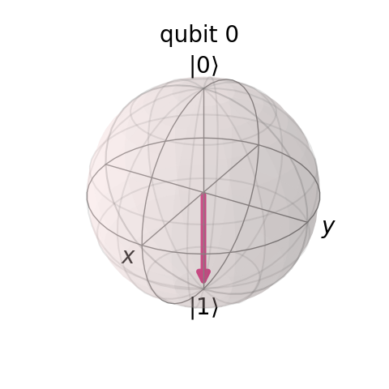
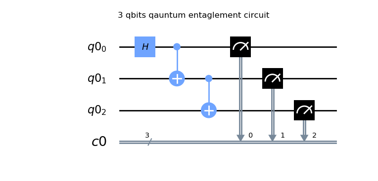
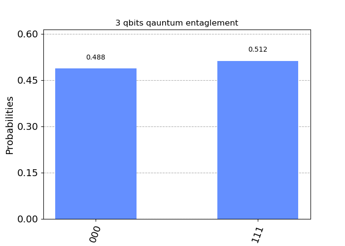
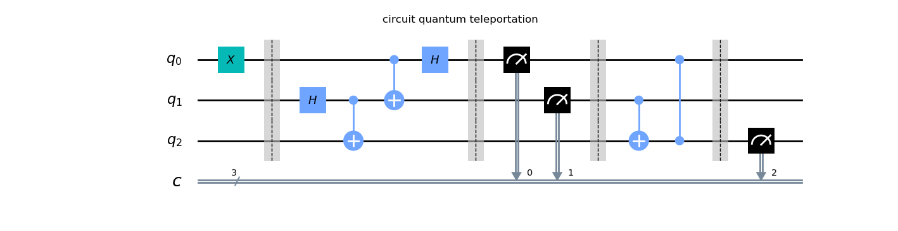
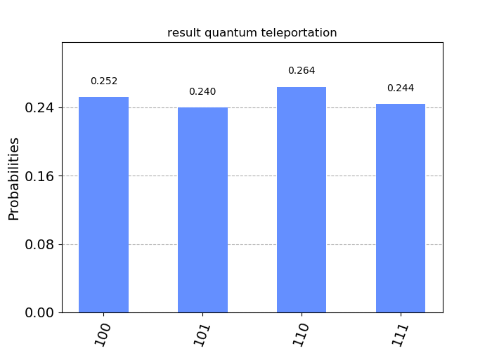

# Basics-of-Quantum-in-Python
Basic quantum programming using IBM's **qiskit** in python.

### Bloch Sphere Representation

### Quantum Entanglement

3-bits quantum-entanglement cirquit :-

Simulation results :-

### Quantum Teleportation

1-bit quantum-teleportation cirquit :-

Simulation results :-

